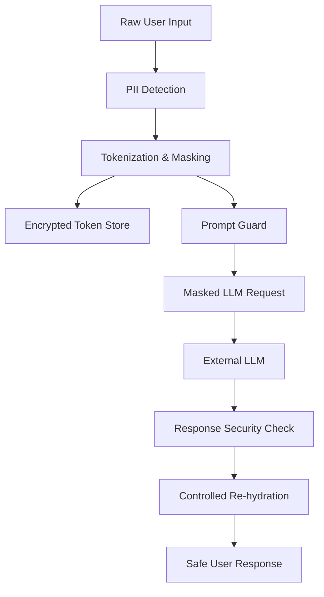

# Secure AI Middleman

A privacy-first middleware/proxy between users/applications and external LLM APIs.

## Project Objective

The fundamental trust boundary: RAW PII MUST NEVER BE SENT TO THE EXTERNAL LLM. Only masked tokens and non-sensitive context may leave the controlled environment.



## Setup

1. **Install Dependencies**
   ```bash
   pip install -r requirements.txt
   python -m spacy download en_core_web_lg
   ```

2. **Configuration**
   Copy `.env.example` to `.env` and fill in API keys if needed (defaults to a mock provider).

3. **Initialize Database**
   ```bash
   python scripts/init_db.py
   ```

4. **Run Server**
   ```bash
   uvicorn app.main:app --reload
   ```

5. **Run Docker**
   ```bash
   docker compose up --build
   ```

## Demo & Benchmark

- **Demo**: `python scripts/demo.py`
- **Benchmark**: `python scripts/run_benchmark.py`
- **Tests**: `pytest`

## API Endpoints

- `POST /api/v1/chat`: Main pipeline
- `POST /api/v1/security/mask`: Preview token masking
- `POST /api/v1/security/analyze`: Preview security risks
- `GET /health`, `/health/ready`, `/health/live`: Health status
- `GET /docs`: Swagger UI for API testing

## Security Limitations & Future Improvements
- Prompt injection detection is rule-based heuristics. Future versions should use an ML classifier.
- Hinglish NER is standard Presidio; a specialized cross-lingual BERT model would improve code-mixed recall.
- Currently uses SQLite; designed to drop in PostgreSQL.
